# Airgapper

<p align="center">
  
</p>

<p align="center">
  <strong>Consensus-based encrypted backups with ransomware protection</strong>
</p>

Airgapper is a control plane for peer-to-peer NAS backups where no single party can read, delete, or restore the data alone. It wraps [restic](https://restic.net) for encrypted backups and uses Shamir's Secret Sharing to split the decryption key between parties.


## Context + Problem

An effective backup strategy for homelabs follows the **3-2-1 principle**: 3 total copies, 2 local (ideally 1 continuous and 1 periodic), and 1 remote copy.

The remote storage is the most critical component of a proper backup solution, but options are limited:

- **Cloud services** with vague privacy policies and ongoing costs
- **Manual setup** on a trusted person's server, which requires:
  - Trust in that person
  - A secure connection
  - Exposure to the security posture of your friend's infrastructure
  - Ongoing maintenance of those backups and their security

Even with a trusted party hosting your backups, you're exposed to these risks:

| Attack | Threat Actor |
|--------|--------------|
| **Read** your backups | Trusted party, malicious actor, or compromised system |
| **Delete** your backups | Trusted party, malicious actor, or ransomware |
| **Overwrite/modify** your data | Malicious actor or compromised backup client |
| **Restore** malicious versions | Insider threat or supply chain attack |
| **Deny access** to your backups | Trusted party dispute or service outage |
| **Exfiltrate** encryption keys | Malware on either endpoint |

## Solution

Airgapper combines **defense in depth**, **append-only storage**, **separation of control plane and data plane**, **immutability**, **encryption**, and **consensus**. It brings blockchain-inspired concepts to a semi-trustless model for storing backups.

> No system is perfect, and I'd love feedback on this concept.

| Attack | Defense | How It Works |
|--------|---------|--------------|
| **Read** backup data | Client-side encryption | Data encrypted with AES-256 before leaving your machine. Host only sees opaque blobs. |
| **Delete/corrupt** backups | Append-only storage | restic-rest-server runs in `--append-only` mode. New data can be written, but nothing deleted or modified. |
| **Overwrite/modify** data | Content-addressable storage | Every blob's filename is its SHA-256 hash. Any modification changes the hash, making tampering detectable. |
| **Restore** without authorization | Consensus-based key release | Decryption requires both parties to release their key shares. Neither can restore alone. |
| **Exfiltrate** encryption key | Shamir's Secret Sharing | Backup password split into shares. Each party holds a fragment—useless alone. Full key only exists briefly during approved restores. |
| **Deny access** to backups | Decentralized control | Owner keeps their share locally. No single party can lock you out. |
| **Tamper** with metadata | Signed verification records | Owner signs cryptographic records of expected state (Merkle roots, file counts). Host cannot forge these. |
| **Silent corruption** | Scheduled integrity checks | Periodic verification compares current state against owner-signed records. Detects unauthorized changes or bit rot. |
| **Ransomware** on owner | Consensus for deletion | Even if attacker compromises owner, they can't delete backups without host approval. Policy contracts enforce retention. |
| **Malicious host** | Detection over prevention | Host can technically delete files, but integrity checks detect it. Owner-signed records prove tampering occurred. |

**Key innovation:** Your backup password is split using Shamir's Secret Sharing (SSS). You keep one share, your trusted peer keeps another. Neither can decrypt alone. To restore, both must agree—creating a trustless checkpoint that protects against compromise on either side.

## Quick Start

> ⚠️ **DISCLAIMER: Experimental Software**
>
> This project has **not been tested with a full backup solution**. Use at your own risk.
>
> - APIs and the entire architecture **will change** over time
> - **Do not use this as your only remote backup** — always maintain other backup copies
> - Only test with small, non-critical data sets
> - Report bugs and issues at [GitHub Issues](https://github.com/lcrostarosa/airgapper/issues)

### Prerequisites

- [restic](https://restic.net/installation/) installed
- [Go 1.25+](https://golang.org/dl/) (for building from source)
- [Node.js 24+ LTS](https://nodejs.org/) (for frontend development)
- A peer (friend, family member, colleague) willing to hold your key share
- (Optional) [restic-rest-server](https://github.com/restic/rest-server) for append-only storage

### Installation

```bash
# Clone the repository
git clone https://github.com/lcrostarosa/airgapper.git
cd airgapper

# Build everything
make build

# Or build just the backend
make backend-build

# The binary is at ./bin/airgapper
./bin/airgapper --help
```

### Development

```bash
# Install frontend dependencies
make frontend-install

# Run frontend dev server (http://localhost:5173)
make frontend-dev

# Run backend in dev mode (http://localhost:8081)
cd backend && go run ./cmd/airgapper serve

# Or set custom port
AIRGAPPER_PORT=8081 go run ./cmd/airgapper serve

# Run both together
make dev

# Run all tests
make test
```

### Docker

```bash
# Build the Docker image
make docker

# Run full stack (storage + backend + frontend)
docker-compose up -d

# View logs
docker-compose logs -f

# Stop
docker-compose down
```

## Workflow Overview

```mermaid
flowchart TB
    subgraph setup["**SETUP (once)**"]
        direction LR
        A1["**Alice**<br/>airgapper init<br/><small>creates repo, splits key</small>"]
        B1["**Bob**<br/>airgapper join<br/><small>stores share</small>"]
        A1 -->|"share"| B1
    end

    subgraph backup["**DAILY BACKUP (no approval needed)**"]
        direction LR
        A2["**Alice**<br/>airgapper backup"]
        S["📦 Append-only<br/>Storage"]
        A2 -->|"encrypted"| S
    end

    subgraph restore["**RESTORE (requires consensus)**"]
        direction TB
        A3["**Alice**<br/>airgapper request"]
        B3["**Bob**<br/>airgapper approve"]
        C3["🔗 Combine Shares"]
        D3["✅ Restore Data"]
        A3 -->|"notify"| B3
        A3 --> C3
        B3 --> C3
        C3 --> D3
    end

    setup --> backup
    backup --> restore
```



### Step by Step

**1. Alice initializes (data owner)**

```bash
# Start a restic-rest-server on Bob's machine (append-only mode)
docker run -d -p 8000:8000 restic/rest-server --append-only --no-auth

# Alice initializes her backup
./bin/airgapper init --name alice --repo rest:http://bob-nas:8000/alice-backup

# Output includes a share to give to Bob:
#   Share:   a1b2c3d4e5f6...
#   Index:   2
```

**2. Alice configures scheduled backups**

```bash
# Set up daily backups at 2 AM
./bin/airgapper schedule --set daily ~/Documents ~/Pictures

# Or use cron syntax
./bin/airgapper schedule --set "0 3 * * *" ~/Documents  # 3 AM daily
```

**3. Bob joins (backup host)**

```bash
# Bob receives Alice's share and joins
./bin/airgapper join --name bob \
  --repo rest:http://localhost:8000/alice-backup \
  --share a1b2c3d4e5f6... \
  --index 2
```

**4. Start the server (runs scheduled backups + API)**

```bash
# Alice runs the server for scheduled backups (default port :8081)
./bin/airgapper serve

# Or set custom port via environment variable
AIRGAPPER_PORT=8081 ./bin/airgapper serve
```

**5. Alice requests restore (requires Bob's approval)**

```bash
./bin/airgapper request --snapshot latest --reason "laptop crashed"
```

**6. Bob approves**

```bash
./bin/airgapper pending
./bin/airgapper approve abc123
```

**7. Alice restores**

```bash
./bin/airgapper restore --request abc123 --target ~/restore/
```

## Architecture

### High-Level Deployment Architecture

How Airgapper is deployed in production between two parties:

```mermaid
flowchart TB
    subgraph alice_network["🏠 Alice's Network (Data Owner)"]
        alice_machine["💻 Alice's Machine<br/><small>Source data</small>"]
        alice_airgapper["🔐 Airgapper<br/><small>Owner Mode :8081</small>"]
        alice_ui["🌐 Web UI<br/><small>:5173</small>"]
        alice_config[("📁 ~/.airgapper/<br/><small>config + key share #1</small>")]

        alice_machine --> alice_airgapper
        alice_ui --> alice_airgapper
        alice_airgapper --> alice_config
    end

    subgraph bob_network["🏠 Bob's Network (Backup Host)"]
        bob_airgapper["🔐 Airgapper<br/><small>Host Mode :8081</small>"]
        bob_ui["🌐 Web UI<br/><small>:5173</small>"]
        bob_config[("📁 ~/.airgapper/<br/><small>config + key share #2</small>")]
        restic_server["📦 restic-rest-server<br/><small>--append-only :8000</small>"]
        backup_storage[("💾 Backup Storage<br/><small>/data/backups</small>")]

        bob_ui --> bob_airgapper
        bob_airgapper --> bob_config
        restic_server --> backup_storage
    end

    subgraph network["☁️ Network (Internet / VPN / Tailscale)"]
        direction LR
        control["Control Plane<br/><small>Consent, approvals,<br/>key exchange</small>"]
        data["Data Plane<br/><small>Encrypted backups</small>"]
    end

    alice_airgapper <-->|"REST API"| control
    bob_airgapper <-->|"REST API"| control
    alice_airgapper -->|"restic CLI"| data
    data -->|"HTTPS"| restic_server
```



**Deployment Notes:**
- **Each party runs their own instance** — no central server
- **Control plane separated from data plane** — consent flows don't touch backup data
- **Works over any network** — internet, VPN, or mesh (Tailscale/Zerotier)
- **Append-only enforcement** — Bob's storage rejects deletions at the protocol level

---

### Low-Level Application Architecture

Internal structure of the Airgapper application:


**Component Overview:**

| Layer | Component | Responsibility |
|-------|-----------|----------------|
| **API** | server.go | HTTP server, CORS, middleware |
| **Core** | config | Node identity, keys, settings |
| **Core** | consent | Restore/deletion request workflows |
| **Core** | scheduler | Cron-based automated backups |
| **Core** | integrity | Hash verification, Merkle trees, scheduled checks |
| **Security** | sss | Shamir's Secret Sharing (split/combine) |
| **Security** | crypto | Ed25519 signing/verification |
| **Security** | policy | Deletion rules, retention enforcement |
| **Storage** | storage | Append-only file serving, quota enforcement |
| **Storage** | restic | Wrapper for restic CLI operations |

## Make Targets

```bash
make help               # Show all targets

# Combined
make build              # Build frontend + backend
make dev                # Run both in dev mode
make test               # Run all tests
make clean              # Clean build artifacts

# Frontend
make frontend-install   # Install npm dependencies
make frontend-dev       # Run Vite dev server
make frontend-build     # Build for production
make frontend-test      # Run frontend tests
make frontend-lint      # Lint frontend code

# Backend
make backend-build      # Build Go binary
make backend-test       # Run Go tests
make backend-lint       # Run Go linters
make backend-fmt        # Format Go code

# Docker
make docker             # Build Docker image
make docker-compose-up  # Start full stack
make docker-compose-down # Stop stack
```

## Documentation

- [Getting Started Guide](docs/GETTING-STARTED.md) - Detailed tutorial
- [Security Model](docs/SECURITY.md) - Threat model and assumptions
- [API Reference](docs/API.md) - HTTP API documentation
- [Design Document](docs/DESIGN.md) - Architecture and design decisions

## Commands

| Command | Description | Who |
|---------|-------------|-----|
| `init` | Initialize as data owner | Owner |
| `join` | Join as backup host | Host |
| `backup` | Create a backup | Owner |
| `snapshots` | List snapshots | Owner |
| `schedule` | Configure backup schedule | Owner |
| `request` | Request restore approval | Owner |
| `pending` | List pending requests | Both |
| `approve` | Approve a request | Host |
| `deny` | Deny a request | Host |
| `restore` | Restore after approval | Owner |
| `status` | Show status | Both |
| `serve` | Run HTTP API + scheduled backups | Both |

## Contributing

Contributions welcome!

```bash
# Development
make build        # Build binary
make test         # Run tests
make backend-lint # Run linters
make help         # Show all targets
```

## License

MIT License - see [LICENSE](LICENSE) for details.

## Credits

Built with:
- [restic](https://restic.net) - Backup engine
- [restic-rest-server](https://github.com/restic/rest-server) - Append-only storage
- [React](https://react.dev) + [Vite](https://vitejs.dev) - Frontend
- Shamir's Secret Sharing - Key splitting

---

*Airgapper: Because backups should survive even if your machine doesn't.*
