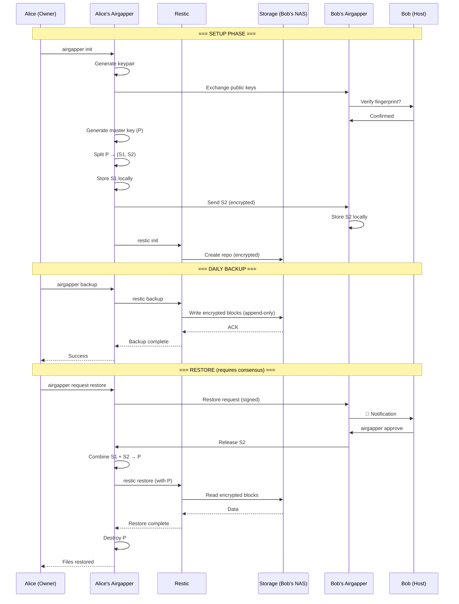

# Airgapper – OSS Design Document

**Version:** 0.1 (Draft)
**Date:** 2026-01-25
**Author:** Henry (AI) + Lucas Crostarosa

---

## Executive Summary

Airgapper is a control plane for ransomware-resistant, peer-to-peer NAS backups. It enables "set and forget" encrypted backups to untrusted storage (e.g., a friend's NAS) where:

- **No single party can read the data** (client-side encryption)
- **No single party can delete the data** (append-only storage)
- **No single party can restore the data** (consensus-based decryption)

This document surveys existing OSS tools, proposes a reference architecture, and defines what Airgapper must build vs. orchestrate.

---

## 1. Survey of Existing OSS Tools

### 1.1 Encrypted Backup Engines

| Tool | Encryption | Dedup | Incremental | Notes |
|------|------------|-------|-------------|-------|
| **Restic** | AES-256-CTR + Poly1305 | Yes | Yes | ⭐ Best fit. Client-side encryption, content-addressed storage, works with any backend |
| **Borg** | AES-256-CTR | Yes | Yes | Excellent, but requires SSH access to remote (not ideal for untrusted hosts) |
| **Duplicati** | AES-256 | Yes | Yes | GUI-focused, less battle-tested |
| **Kopia** | AES-256-GCM | Yes | Yes | Modern alternative to Restic, good API |
| **rclone** | Optional | No | Sync only | Transport layer, not a backup engine |

**Verdict:** Restic or Kopia are the best candidates for the data plane. Both support:
- Client-side encryption (storage host sees only ciphertext)
- Content-addressed deduplication
- Multiple backend types (SFTP, REST, S3-compatible)

### 1.2 Append-Only / Immutable Storage

| Tool | Immutability Model | Notes |
|------|-------------------|-------|
| **Restic `--append-only`** | Server-side mode | REST server can enforce append-only; client can't delete |
| **MinIO Object Lock** | S3 WORM compliance | Retention periods, legal holds |
| **ZFS snapshots** | Filesystem-level | Read-only snapshots, but requires ZFS on remote |
| **Btrfs snapshots** | Filesystem-level | Similar to ZFS |
| **restic-rest-server** | Append-only mode | Purpose-built for Restic, simple deployment |

**Verdict:** `restic-rest-server --append-only` is the simplest path. For deeper immutability, ZFS/Btrfs snapshots on the storage host add defense-in-depth, but require cooperation from the host operator.

### 1.3 Threshold / Consensus Key Access

| Tool | Model | Notes |
|------|-------|-------|
| **Shamir's Secret Sharing (SSS)** | k-of-n key splitting | Well-understood, many implementations (ssss, hashicorp vault) |
| **Threshold Signatures (TSS)** | k-of-n signing without reconstruction | More complex, used in crypto wallets |
| **age + plugins** | Modern encryption, plugin architecture | Could implement threshold via plugins |
| **Hashicorp Vault** | Centralized secrets management | Overkill for peer-to-peer, introduces server dependency |
| **Keybase/Saltpack** | Identity-based encryption | Deprecated (acquired by Zoom) |

**Verdict:** Shamir's Secret Sharing is the pragmatic choice:
- Well-understood cryptography
- No need to reconstruct key during normal backups (only on restore)
- Simple 2-of-2 implementation possible
- Libraries available in Go, Rust, Python

### 1.4 What Exists vs. What Must Be Built

| Capability | Existing OSS | Gap |
|------------|-------------|-----|
| Encrypted backups | ✅ Restic, Kopia | None |
| Append-only storage | ✅ restic-rest-server | None |
| Client-side key management | ✅ Restic handles repo keys | None |
| Threshold key splitting | ✅ SSS libraries | Integration needed |
| **Consensus restore flow** | ❌ Nothing | **Must build** |
| **Multi-party approval UX** | ❌ Nothing | **Must build** |
| **Trust bootstrapping** | ❌ Nothing | **Must build** |
| **Restore authorization** | ❌ Nothing | **Must build** |

**Airgapper's core contribution:** The consensus/approval layer that wraps existing backup tools.

---

## 2. Reference Architecture

### 2.1 High-Level Diagram

```
┌─────────────────────────────────────────────────────────────────────────────┐
│                              AIRGAPPER SYSTEM                               │
├─────────────────────────────────────────────────────────────────────────────┤
│                                                                             │
│  ┌─────────────────┐                           ┌─────────────────┐          │
│  │   ALICE (Owner) │                           │   BOB (Host)    │          │
│  │                 │                           │                 │          │
│  │  ┌───────────┐  │      Encrypted Data       │  ┌───────────┐  │          │
│  │  │  Restic   │──┼──────────────────────────▶│  │REST Server│  │          │
│  │  │  Client   │  │      (append-only)        │  │(append)   │  │          │
│  │  └───────────┘  │                           │  └───────────┘  │          │
│  │       │         │                           │       │         │          │
│  │       ▼         │                           │       ▼         │          │
│  │  ┌───────────┐  │                           │  ┌───────────┐  │          │
│  │  │ Airgapper │  │◀─── Approval Request ────▶│  │ Airgapper │  │          │
│  │  │  Agent    │  │                           │  │  Agent    │  │          │
│  │  └───────────┘  │                           │  └───────────┘  │          │
│  │       │         │                           │       │         │          │
│  │       ▼         │                           │       ▼         │          │
│  │  ┌───────────┐  │                           │  ┌───────────┐  │          │
│  │  │Key Share 1│  │                           │  │Key Share 2│  │          │
│  │  │ (Alice)   │  │                           │  │  (Bob)    │  │          │
│  │  └───────────┘  │                           │  └───────────┘  │          │
│  │                 │                           │                 │          │
│  └─────────────────┘                           └─────────────────┘          │
│                                                                             │
│  ┌─────────────────────────────────────────────────────────────────┐        │
│  │                        RESTORE FLOW                             │        │
│  │                                                                 │        │
│  │  1. Alice requests restore                                      │        │
│  │  2. Airgapper notifies Bob                                      │        │
│  │  3. Bob approves (or denies)                                    │        │
│  │  4. Both key shares combine → Repo unlocked                     │        │
│  │  5. Alice restores data                                         │        │
│  │  6. Combined key destroyed after timeout                        │        │
│  │                                                                 │        │
│  └─────────────────────────────────────────────────────────────────┘        │
│                                                                             │
└─────────────────────────────────────────────────────────────────────────────┘
```

### 2.2 Component Layers

#### Data Plane (Backup Engine)
- **Component:** Restic (or Kopia)
- **Responsibility:** Encrypt, dedupe, transfer backup data
- **Trust:** Handles encryption; Airgapper manages the key
- **Interface:** CLI wrapper or library bindings

#### Storage Plane (Immutability)
- **Component:** restic-rest-server in append-only mode
- **Responsibility:** Accept writes, reject deletes
- **Trust:** Untrusted (can't read data, can't delete)
- **Defense-in-depth:** ZFS snapshots on host (optional)

#### Control Plane (Consensus)
- **Component:** Airgapper daemon/agent
- **Responsibility:**
  - Key share custody
  - Approval flow orchestration
  - Restore authorization
  - Audit logging
- **Trust:** Distributed across parties

### 2.3 Trust Boundaries & Threat Model

```
┌──────────────────────────────────────────────────────────────────┐
│                        THREAT MODEL                              │
├──────────────────────────────────────────────────────────────────┤
│                                                                  │
│  ATTACKER GOALS           │  MITIGATIONS                         │
│  ─────────────────────────┼────────────────────────────────────  │
│  Read backup data         │  Client-side encryption (AES-256)    │
│  Delete/corrupt backups   │  Append-only storage + ZFS snapshots │
│  Ransomware entire backup │  No delete capability on storage     │
│  Steal encryption key     │  Key split via SSS (2-of-2)          │
│  Coerce single party      │  Requires consensus for restore      │
│  Impersonate party        │  Cryptographic identity (keypairs)   │
│                                                                  │
│  TRUST ASSUMPTIONS:                                              │
│  • Alice's machine is trusted during backup                      │
│  • Bob's storage is untrusted (honest-but-curious)               │
│  • Neither party alone can decrypt                               │
│  • Communication channel can be observed (use TLS)               │
│  • At least one party is not compromised during restore          │
│                                                                  │
│  OUT OF SCOPE:                                                   │
│  • Hardware attacks on NAS                                       │
│  • Nation-state adversaries                                      │
│  • Denial of service (Bob can always refuse to host)             │
│  • Key share loss (separate recovery mechanism needed)           │
│                                                                  │
└──────────────────────────────────────────────────────────────────┘
```

---

## 3. Consensus Mechanism

### 3.1 Approach: Shamir's Secret Sharing (SSS)

**Why SSS over alternatives:**

| Approach | Pros | Cons | Verdict |
|----------|------|------|---------|
| **Shamir's Secret Sharing** | Simple, well-understood, no interaction during backup | Key must be reconstructed in memory | ✅ Best fit |
| **Threshold Signatures** | Key never reconstructed | Complex, overkill for file decryption | ❌ |
| **Multi-party Encryption** | Each party encrypts to others | Key management complexity | ❌ |
| **Blockchain voting** | Auditability | Massive overkill, unnecessary complexity | ❌ |

### 3.2 How 2-of-2 Works Operationally

```
┌─────────────────────────────────────────────────────────────────┐
│                    KEY LIFECYCLE                                │
├─────────────────────────────────────────────────────────────────┤
│                                                                 │
│  SETUP (once):                                                  │
│  ┌─────────────────────────────────────────────────────────┐    │
│  │ 1. Alice generates Restic repo password (P)             │    │
│  │ 2. Airgapper splits P into (S1, S2) using 2-of-2 SSS    │    │
│  │ 3. S1 stored on Alice's machine (encrypted at rest)     │    │
│  │ 4. S2 sent to Bob's Airgapper agent (encrypted at rest) │    │
│  │ 5. Original P is destroyed                              │    │
│  └─────────────────────────────────────────────────────────┘    │
│                                                                 │
│  NORMAL BACKUP (daily):                                         │
│  ┌─────────────────────────────────────────────────────────┐    │
│  │ • Alice's Restic uses a SEPARATE "backup-only" key      │    │
│  │ • This key can WRITE but not READ old snapshots         │    │
│  │ • Append-only mode enforced server-side                 │    │
│  │ • No consensus needed for backups                       │    │
│  └─────────────────────────────────────────────────────────┘    │
│                                                                 │
│  RESTORE (rare):                                                │
│  ┌─────────────────────────────────────────────────────────┐    │
│  │ 1. Alice initiates restore request via Airgapper        │    │
│  │ 2. Bob receives notification (push/email/SMS)           │    │
│  │ 3. Bob reviews request (what data, why)                 │    │
│  │ 4. Bob approves → S2 released to secure channel         │    │
│  │ 5. Alice's agent combines S1 + S2 → P (in memory)       │    │
│  │ 6. Restic restore runs with P                           │    │
│  │ 7. P destroyed after restore completes (or timeout)     │    │
│  └─────────────────────────────────────────────────────────┘    │
│                                                                 │
└─────────────────────────────────────────────────────────────────┘
```

### 3.3 UX Risks & Edge Cases

| Scenario | Risk | Mitigation |
|----------|------|------------|
| **Bob is unavailable** | Can't restore | Add third party (2-of-3), or time-delayed auto-release |
| **Alice loses her share** | Can't restore | Escrow with trusted third party, or hardware backup |
| **Bob malicious** | Refuses all restores | Legal agreement, or 2-of-3 with neutral party |
| **Both compromised** | Data exposed | Out of scope (requires >2 parties) |
| **Ransomware on Alice** | Attacker requests restore | Bob must verify out-of-band (phone call) |
| **Key share theft** | Attacker has one share | Still need second share; consider key rotation |

### 3.4 Alternative: Backup-Only vs. Full-Access Keys

A cleaner model separates key types:

```
┌────────────────────────────────────────────────────────────┐
│  KEY HIERARCHY                                             │
├────────────────────────────────────────────────────────────┤
│                                                            │
│  MASTER KEY (P)                                            │
│  └── Split via SSS → S1 (Alice), S2 (Bob)                  │
│      └── Only reconstructed for restore                    │
│                                                            │
│  BACKUP KEY (B)                                            │
│  └── Derived from P, but limited:                          │
│      • Can append new snapshots                            │
│      • Cannot read existing snapshots                      │
│      • Cannot delete anything                              │
│  └── Stored locally on Alice's machine                     │
│                                                            │
│  This requires Restic modification or wrapper logic.       │
│  Current Restic: single repo key for all operations.       │
│                                                            │
│  WORKAROUND: Use append-only server + separate restore     │
│  machine that never touches production.                    │
│                                                            │
└────────────────────────────────────────────────────────────┘
```

---

## 4. Airgapper's Value Layer

### 4.1 Build vs. Orchestrate

| Capability | Build or Orchestrate | Implementation |
|------------|---------------------|----------------|
| Backup execution | **Orchestrate** | Wrap Restic/Kopia CLI |
| Client-side encryption | **Orchestrate** | Restic handles this |
| Append-only storage | **Orchestrate** | restic-rest-server |
| Key splitting (SSS) | **Orchestrate** | Use existing SSS library |
| **Key share custody** | **BUILD** | Secure storage, access control |
| **Approval flow** | **BUILD** | Request/approve protocol |
| **Notification system** | **BUILD** | Push/email/webhook alerts |
| **Restore authorization** | **BUILD** | Consent verification, key release |
| **Audit logging** | **BUILD** | Immutable log of all operations |
| **Trust bootstrapping** | **BUILD** | Initial setup ceremony |
| **Identity & auth** | **BUILD** | Keypair generation, verification |

### 4.2 Core Airgapper Components

```
┌─────────────────────────────────────────────────────────────────┐
│                    AIRGAPPER COMPONENTS                         │
├─────────────────────────────────────────────────────────────────┤
│                                                                 │
│  airgapper-agent                                                │
│  ├── Key custody module                                         │
│  │   ├── Secure storage (OS keychain / TPM / encrypted file)   │
│  │   ├── SSS share management                                   │
│  │   └── Key release logic                                      │
│  │                                                              │
│  ├── Approval workflow                                          │
│  │   ├── Request creation                                       │
│  │   ├── Request verification                                   │
│  │   ├── Approval/denial handling                               │
│  │   └── Timeout management                                     │
│  │                                                              │
│  ├── Communication layer                                        │
│  │   ├── Peer discovery (mDNS / manual config)                  │
│  │   ├── Secure channel (Noise protocol / TLS)                  │
│  │   └── Notification dispatch (webhook / Pushover / email)     │
│  │                                                              │
│  ├── Backup orchestration                                       │
│  │   ├── Restic wrapper                                         │
│  │   ├── Schedule management                                    │
│  │   └── Health checks                                          │
│  │                                                              │
│  └── Audit log                                                  │
│      ├── Append-only local log                                  │
│      ├── Signed entries                                         │
│      └── Optional replication to peer                           │
│                                                                 │
│  airgapper-cli                                                  │
│  ├── init          # Bootstrap new backup relationship          │
│  ├── backup        # Trigger backup                             │
│  ├── request       # Request restore approval                   │
│  ├── approve       # Approve pending request                    │
│  ├── deny          # Deny pending request                       │
│  ├── status        # Show backup/restore status                 │
│  └── audit         # View audit log                             │
│                                                                 │
└─────────────────────────────────────────────────────────────────┘
```

### 4.3 Workflow: Initial Setup ("Trust Bootstrapping")

```bash
# On Alice's machine:
$ airgapper init --name "alice-nas-backup" --peer bob@192.168.1.50

  Airgapper Setup Wizard
  ──────────────────────
  1. Generating identity keypair... done
  2. Contacting peer (bob@192.168.1.50)... connected
  3. Exchanging public keys...
  
  ⚠️  VERIFY BOB'S FINGERPRINT OUT-OF-BAND:
     SHA256:xK3m9...7Fp2Q
  
  Does this match what Bob sees? [y/N]: y
  
  4. Generating master repository key...
  5. Splitting key (2-of-2)...
  6. Storing share 1 locally... done
  7. Sending share 2 to Bob... done
  8. Initializing Restic repository...
  9. Configuring append-only mode on Bob's server...
  
  ✅ Setup complete!
  
  Your backup repository is ready.
  Run `airgapper backup` to start your first backup.
```

### 4.4 Workflow: Restore Approval

```
┌─────────────────────────────────────────────────────────────────┐
│  ALICE (requestor)                BOB (approver)                │
├─────────────────────────────────────────────────────────────────┤
│                                                                 │
│  $ airgapper request \                                          │
│      --snapshot latest \                                        │
│      --path /home/alice/documents                               │
│                                                                 │
│  📤 Restore request sent to Bob                                 │
│  Waiting for approval...                                        │
│                               ┌──────────────────────────┐      │
│                               │ 📱 PUSH NOTIFICATION     │      │
│                               │                          │      │
│                               │ Alice requests restore:  │      │
│                               │ • Snapshot: 2026-01-25   │      │
│                               │ • Path: /documents       │      │
│                               │ • Reason: "laptop died"  │      │
│                               │                          │      │
│                               │ [Approve] [Deny] [Info]  │      │
│                               └──────────────────────────┘      │
│                                                                 │
│                               $ airgapper approve abc123        │
│                                                                 │
│                               ✅ Approved. Key share released.  │
│                                                                 │
│  ✅ Approval received!                                          │
│  Reconstructing key...                                          │
│  Starting restore...                                            │
│                                                                 │
│  Restored 42.3 GB to /home/alice/restore/                       │
│  Key destroyed.                                                 │
│                                                                 │
└─────────────────────────────────────────────────────────────────┘
```

---

## 5. MVP Features

### 5.1 Must Have (v0.1)

- [ ] **Identity management** - Keypair generation, fingerprint verification
- [ ] **Key splitting** - 2-of-2 Shamir's Secret Sharing
- [ ] **Key share storage** - Encrypted local storage
- [ ] **Restic wrapper** - Init, backup, restore commands
- [ ] **Append-only enforcement** - Configure restic-rest-server
- [ ] **Restore request flow** - Create, send, receive requests
- [ ] **Approval flow** - Approve/deny with key release
- [ ] **Basic notifications** - Webhook or stdout
- [ ] **Audit log** - Local append-only log

### 5.2 Should Have (v0.2)

- [ ] **Push notifications** - Pushover, ntfy.sh integration
- [ ] **Email notifications** - SMTP support
- [ ] **Request expiry** - Auto-deny after timeout
- [ ] **Multiple peers** - 2-of-3 or m-of-n support
- [ ] **Backup scheduling** - Cron-like scheduler
- [ ] **Health monitoring** - Backup age alerts

### 5.3 Nice to Have (v1.0)

- [ ] **Web UI** - Status dashboard
- [ ] **Mobile app** - Approve from phone
- [ ] **Key rotation** - Periodic key refresh
- [ ] **Disaster recovery** - Key escrow options
- [ ] **Multi-repo** - Multiple backup targets

---

## 6. Risks & Open Questions

### 6.1 Technical Risks

| Risk | Likelihood | Impact | Mitigation |
|------|------------|--------|------------|
| SSS implementation bugs | Medium | High | Use audited library, test extensively |
| Key share loss | Medium | Critical | Document recovery procedures, consider escrow |
| Restic API changes | Low | Medium | Pin versions, maintain compatibility layer |
| Network partition during restore | Low | Medium | Retry logic, timeout handling |

### 6.2 Open Questions

1. **Backup-only key separation** - Restic doesn't natively support write-only keys. Options:
   - Accept that backup machine can read (rely on append-only for protection)
   - Fork Restic to add key separation
   - Use a proxy that strips read capabilities

2. **Peer discovery** - How do Alice and Bob find each other?
   - Manual IP/hostname configuration (MVP)
   - mDNS for local network
   - Relay server for NAT traversal (adds trust dependency)

3. **Key escrow** - What if both parties lose their shares?
   - Paper backup of combined key in safe deposit box?
   - Third-party escrow with time-lock?
   - Accept data loss as feature (true air gap)?

4. **Legal/social contract** - Technical controls only go so far:
   - Should Airgapper generate a "backup agreement" template?
   - How to handle disputes?

5. **Scaling beyond 2 parties** - 2-of-3 is straightforward, but:
   - How to handle key share updates when parties change?
   - What's the UX for m-of-n approval?

---

## 7. Recommendation

### Thin Orchestrator vs. Deeper System?

**Recommendation: Start as a thin orchestrator, thicken as needed.**

**Phase 1 (thin orchestrator):**
- Wrap Restic CLI
- Use existing SSS library
- Simple peer-to-peer communication
- Config files for state

**Phase 2 (thicken where needed):**
- Custom key management if Restic limitations block features
- Daemon mode for always-on approval handling
- Database for audit logs if files don't scale

**Rationale:**
- Restic is battle-tested; don't rebuild the wheel
- Consensus layer is the novel contribution
- Keep attack surface small
- Ship faster, iterate based on real usage

### Implementation Language

**Recommendation: Go or Rust**

- **Go**: Easier to write, Restic is in Go, good CLI tooling
- **Rust**: Better security properties, but steeper learning curve

For MVP, Go is likely faster to ship. Consider Rust for security-critical components (key handling) later.

---

## 8. Next Steps

1. **Validate architecture** with security-minded peers
2. **Prototype SSS integration** with a simple Go/Rust CLI
3. **Test Restic append-only** mode in adversarial scenarios
4. **Design approval protocol** message format
5. **Build MVP** of init + backup + restore flow
6. **Document threat model** more formally
7. **Write "getting started" guide** for early adopters

---

## Appendix A: Mermaid Diagram



---

## Appendix B: Related Projects

- **Restic**: https://restic.net
- **Kopia**: https://kopia.io
- **restic-rest-server**: https://github.com/restic/rest-server
- **ssss (Shamir's)**: http://point-at-infinity.org/ssss/
- **age encryption**: https://age-encryption.org
- **Noise Protocol**: https://noiseprotocol.org

---

*Document generated by Henry. Review and iterate.*
